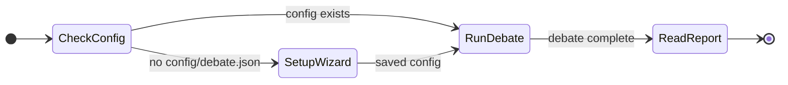
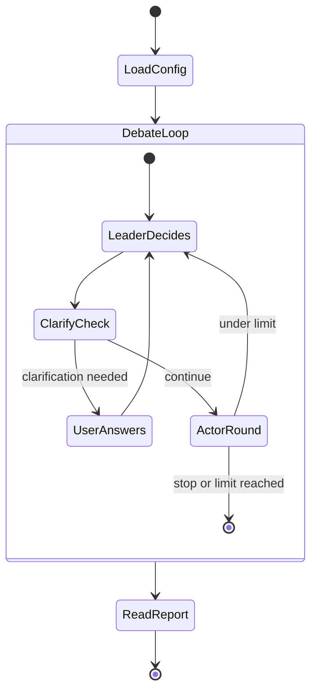
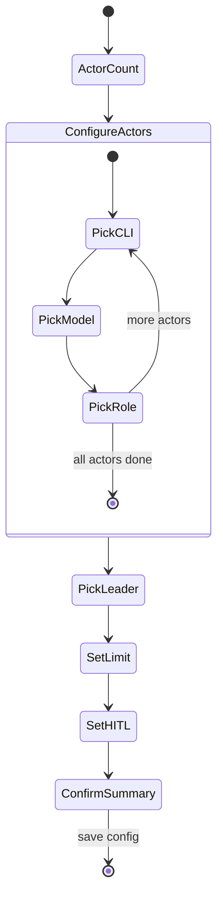

# AGENTS.md

Technical reference for coding agents working on Roundtable. Human contributors should start with [ONBOARDING.md](./ONBOARDING.md) and [README.md](./README.md).

## Architecture

Core boundaries:

| Module | Responsibility |
|--------|----------------|
| `src/parser.ts` | CLI flags, request text, `@file` references |
| `src/context.ts` | Loading context files from local paths |
| `src/session.ts` | Report creation, appends, compaction updates |
| `src/adapters.ts` | Local CLI process invocation, stream normalization |
| `src/engine/` | Leader decisions, actor rounds, clarification, stopping, synthesis |
| `src/setup/` | First-run wizard flow and setup TUI |
| `src/terminal/` | Shared raw-mode terminal helpers |

Each adapter implements:

```ts
runActor(prompt, onChunk)
runLeader(prompt, expectedDecision)
```

## Session flow



### Debate loop



### Setup wizard



## Config

Saved at `config/debate.json`. Key fields:

- `actors[]` — `{ cli, model, role }` per participant
- `leader` — CLI id that orchestrates
- `limit` — max leader-issued debate questions (clarifications excluded)
- `humanInTheLoop` — whether leader may pause once for user input
- `debateMode` — inferred, not user-selected:
  - **multi-cli** — one role per CLI
  - **single-cli** — multiple roles on the same CLI

## Debate engine rules

- Actors are **peers**. Same bounded context; challenge assumptions; answer the leader’s current question.
- The **leader** orchestrates only — clarify, next question, compact memory, finish. It is not the sole source of truth.
- The leader **cannot** finish before at least one full actor round. If it tries early synthesis, the engine forces a critique round first.
- The **markdown report** is the durable source of truth. Agents do not edit it; the tool writes events, compaction, failures, and synthesis.
- **Compaction** — after each round, the leader updates `Running Context` so later prompts use summary + recent transcript, not full history.
- **Failures** — one actor failing is recorded; debate continues. If every actor in a round fails, stop with a failure synthesis.

### Leader decision shape (internal)

- `needsClarification`
- `clarificationQuestion`
- `nextQuestion`
- `roundSummary`
- `shouldStop`
- `finalSynthesis`

## Context files

References: `@file.md`, `@./docs/plan.md`, `@/absolute/path.md`, or implicit `./plan.md` / `/absolute/path.md` mentions.

- Resolved from the current working directory, or as absolute/`~` paths
- No external URL fetching in v1

## Adapter commands

Default invocations (read-only / plan modes):

```sh
codex exec --skip-git-repo-check --sandbox read-only --color never -
claude -p --permission-mode plan --output-format stream-json --verbose
gemini --prompt ... --approval-mode plan --output-format stream-json
agent -p --plan --trust --output-format stream-json --model auto "..."
```

Default model flags appended by the tool:

```sh
codex --model gpt-5.5 --config 'model_reasoning_effort="high"'
claude --model sonnet --thinking enabled
gemini --model gemini-2.5-flash
agent --model auto
```

## Terminal UI

**Interactive TTY** — live dashboard: round, leader question, roster, participant table with spinners. Leader and participant rows are labeled in plain language. Actor text is **not** streamed to the terminal; it goes to the report.

**Non-TTY** — `[roundtable]` status lines, start/finish announcements, heartbeats on long calls.

## Output files

- Report: `YYYY-MM-DD-short-topic.md` in the current working directory (deduped with numeric suffix)
- Log: sibling `.log.jsonl`

Report sections: request, context refs, Running Context, per-round Q&A, failures, final synthesis, leader notes on model performance.

## Development

```sh
corepack pnpm test
node src/cli.ts "your question"
```

Tests use mock adapter commands — no real model access required.

## Built-in roles

`peer`, `proposer`, `critic`, `verifier`, `contrarian`, `pragmatist` — see `src/roles.ts` for behavior prompts. Custom roles: `[a-z][a-z0-9-]{0,31}`.
