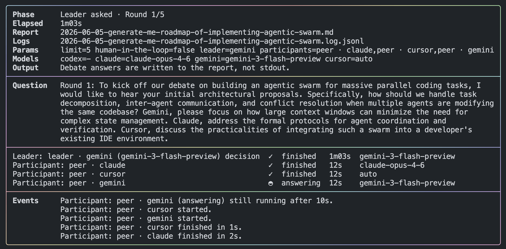

# Roundtable CLI

**One question. Multiple views. One answer.**



Roundtable sits your local AI tools at the same table — Codex, Claude, Gemini, and Cursor — and lets them challenge each other on your question. A leader keeps the conversation moving. You get a saved markdown report with the final synthesis.

Good for launch plans, architecture reviews, product ideas, and anything where one model’s first reply isn’t enough.


## What you need

- **Node.js** 22.6 or newer
- **pnpm** (via Corepack)
- At least one local AI CLI on your `PATH`:
  - `codex`
  - `claude`
  - `gemini`
  - `agent` (Cursor — install with `curl https://cursor.com/install -fsS | bash`)

## Quick start

**1. Install dependencies and verify**

```sh
corepack pnpm install
corepack pnpm test
```

**2. Run your first roundtable**

```sh
roundtable "Review this launch plan and flag the biggest risks"
```

The first time you run `roundtable` in a project folder, a setup wizard opens. Pick your participants, models, and a leader. Settings are saved to `config/debate.json`.

**3. Read the report**

When the run finishes, the terminal shows two paths:

- **Report** — `YYYY-MM-DD-topic.md` in the current directory (read this)
- **Logs** — detailed session log for debugging

The live terminal shows progress, not full model replies. Open the markdown report for the full debate and final answer.

## Attach reference files

Reference any local file path in your question with `@`:

```sh
roundtable "Review this plan @./docs/plan.md"
roundtable "Compare these notes @/tmp/brief.md"
```

## Examples

```sh
roundtable "Review this launch plan and identify the biggest risks"
roundtable "Help improve this architecture proposal @proposal.md"
roundtable "Generate competing product strategy options"
roundtable "Critique this implementation plan" --leader=claude --limit=6
roundtable "Compare these ideas" --clis=codex,gemini --human-in-the-loop=false
roundtable "Stress-test this design" --single-cli=claude:proposer,critic,verifier
roundtable --help
```

## First-run setup (what the wizard asks)

1. **How many participants?** — Each gets a CLI, model, and role.
2. **For each participant** — Pick CLI → model → role (Peer, Critic, Proposer, etc.).
3. **Leader** — Which CLI runs the roundtable and writes the final synthesis.
4. **Question limit** — How many debate rounds to allow (default `5`). Clarifying questions do not count.
5. **Human in the loop** — If on, the leader may ask you one clarification question mid-run.

To reconfigure, run `roundtable` again and choose **Setup from scratch**, or delete `config/debate.json`.

### Manual config (non-interactive environments)

If the wizard cannot run (no TTY), copy [config/debate.example.json](./config/debate.example.json) to `config/debate.json` and edit it. See the [Configuration](#configuration) section below.

## Roles

Each participant gets a role that shapes how they respond. The setup wizard lets you pick one per actor; you can also assign roles per run with `--actors=claude:proposer,gemini:critic`.

### Built-in roles


| Role           | What it does                                                                                                 |
| -------------- | ------------------------------------------------------------------------------------------------------------ |
| **Peer**       | Neutral challenger. Improves reasoning and engages with others’ strongest points without claiming authority. |
| **Proposer**   | Commits to a clear, defensible position and defends it with explicit reasoning.                              |
| **Critic**     | Breaks the strongest argument on the table — gaps, edge cases, counterexamples, unsupported assumptions.     |
| **Verifier**   | Audits factual claims. Marks assertions as verified, unverified, likely wrong, or cannot assess.             |
| **Contrarian** | Steelmans the least popular or most dismissed position the group may be overlooking.                         |
| **Pragmatist** | Translates abstract debate into feasibility, cost, failure modes, and concrete next steps.                   |


### Custom roles

During setup you can define a custom role with your own behavioral instructions. Saved custom roles are stored in `config/debate.json` under `customRoles` and appear in the role picker for later participants. Custom role ids use lowercase letters, numbers, and hyphens (max 32 characters).

## Options


| Flag                                     | What it does                                                                 |
| ---------------------------------------- | ---------------------------------------------------------------------------- |
| `--help`, `-h`                           | Show usage, flags, and examples                                              |
| `--clis=codex,claude,gemini,cursor`      | Who participates this run (default role: peer)                               |
| `--actors=claude:proposer,gemini:critic` | Assign a role to each CLI this run                                           |
| `--single-cli=claude:proposer,critic`    | Multiple roles on one CLI (single-cli mode); leader must match that CLI      |
| `--leader=codex`                         | Who leads (codex, claude, gemini, cursor)                                    |
| `--limit=12`                             | Max debate questions (clarifications excluded)                               |
| `--human-in-the-loop=true`               | Leader may ask you one question mid-run                                      |
| `--claude-model=claude-opus-4-6`         | Claude model (default from config or built-in default)                       |
| `--codex-model=gpt-5.5`                  | Codex model                                                                  |
| `--gemini-model=gemini-3-flash-preview`  | Gemini model                                                                 |
| `--cursor-model=auto`                    | Cursor model                                                                 |


Short forms like `-limit=6` also work. Use `--name=value` or `--name value`.

## Configuration

Settings live in `config/debate.json`. An annotated template is at [config/debate.example.json](./config/debate.example.json).

| Field | Meaning |
| ----- | ------- |
| `actors[]` | Each participant: `cli`, `role`, optional `model` |
| `leader` | CLI id that orchestrates (must match an actor CLI) |
| `limit` | Max leader-issued debate questions |
| `humanInTheLoop` | Whether the leader may pause once for your input |
| `models` | Default model per CLI (first model per CLI wins when duplicated) |
| `debateMode` | Inferred: `multi-cli` or `single-cli` — do not set manually |
| `customRoles` | Optional map of custom role id → behavior text |

Config id `cursor` refers to the `agent` command on your PATH.

## What’s in the report

Each run saves a markdown file in the current directory with:

- Your original question
- A running summary of the discussion
- Each round’s questions and answers
- The final synthesis
- Any failures (one model failing does not stop the others)

## Contributing & internals

New contributors: start with [ONBOARDING.md](./ONBOARDING.md). For architecture, debate engine rules, adapter details, and development setup, see [AGENTS.md](./AGENTS.md).
